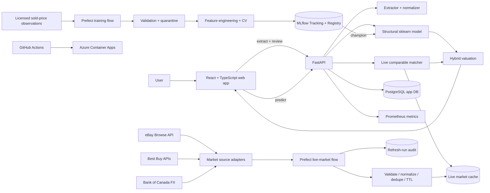

# System architecture

## Two distinct data contracts

The system deliberately separates **training truth** from **current market evidence**.

**Training data** requires an observed outcome such as a completed/sold price. It is allowed to influence model parameters and offline MAE/RMSE/R².

**Live market data** contains current asking, retail, or open-box prices. It is stored with source provenance and listing type, expires quickly, and is allowed to calibrate an individual valuation through comparable matching. It is not silently relabeled as a sold-price target.

That split avoids a common marketplace-model failure: training a model to reproduce seller asking prices and then calling the result “fair value.”

## Runtime responsibilities

The React application owns listing input, mandatory review/correction, market-source status, and result/comparable presentation.

FastAPI owns API validation, extraction, normalization, persistence, the structural model contract, comparable selection, hybrid blending, and telemetry. `asking_price` is only used after valuation to calculate the value rating.

PostgreSQL stores application entities plus a short-lived `live_market_listings` cache and `market_refresh_runs` audit trail.

Prefect is the only orchestrator. One flow owns the raw-to-training path; a second owns provider refresh/retry/quality control. The live refresher executes immediately on startup and then serves an hourly cron schedule.

MLflow owns experiment/model lineage and the production `champion` alias. It does not turn active market listings into training truth.
