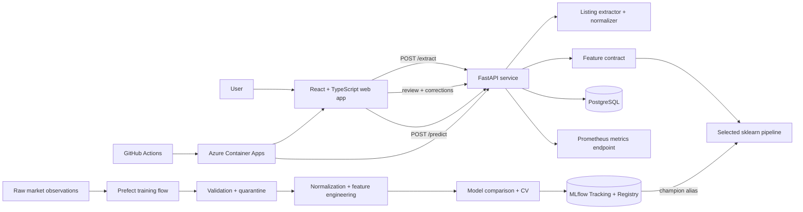

# System architecture

## Runtime responsibilities

The React application owns listing input, review/correction, and explanation presentation. It never silently edits extracted hardware before the user sees it.

FastAPI owns validation, extraction, normalization, the inference contract, persistence, and metrics. The model pipeline accepts normalized/engineered features only; asking price is used after inference to compute the value rating and is not a prediction feature.

PostgreSQL stores listings, normalized specs, corrections, prediction outcomes, model metadata, and market observations. MLflow uses a database-backed registry so experiment lineage and the promoted model version are auditable.

Prefect owns the batch training-data path. It is intentionally the only orchestrator in the project.
