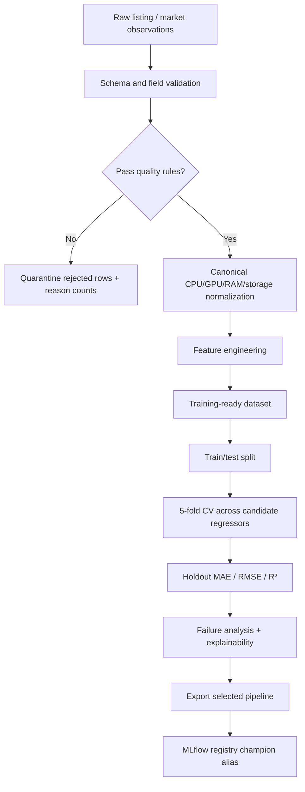

# Data pipeline

## Data-quality checks

`ml.pipeline.quality.validate_market_data` rejects or records duplicate source IDs/rows, missing CPU/GPU, impossible RAM/storage capacity, impossible target prices, and normalization failures. The flow writes both the valid training dataset and a rejected-row file plus JSON quality statistics.

The quality layer is deliberately before training. A model should not silently absorb malformed prices or impossible hardware values and then make those defects part of its learned behavior.

## Source adapter contract

The included CSV is synthetic demo data. A real source adapter should output the same columns (`source_id`, normalized hardware candidates, condition, age, asking price if available, and an observed target such as sold price). Marketplace terms, licensing, and privacy constraints should be reviewed before adding a scraper. The rest of the pipeline is source-agnostic.
