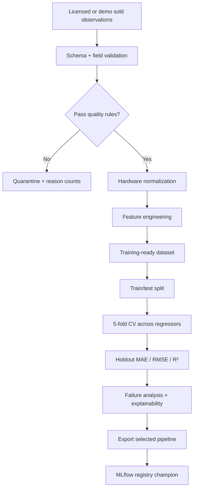
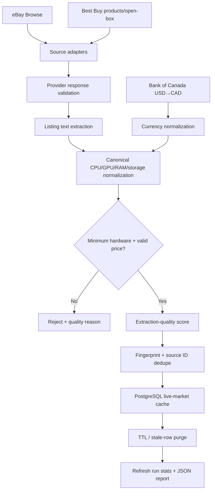

# Data pipelines

The project now has two related but intentionally separate pipelines.

## 1. Model-development / training pipeline

The training target is an observed outcome such as `sold_price`. `asking_price` is excluded from the feature contract.

## 2. Live-market refresh pipeline

## Live quality checks

The refresh pipeline tracks:

- provider fetch counts and provider-level errors;
- missing/invalid prices;
- unsupported currencies or FX failures;
- listings with no recognizable CPU or GPU;
- malformed/low-quality extraction;
- duplicate source listing IDs;
- cross-source/current-refresh duplicate fingerprints;
- inserted versus updated observations;
- expired rows purged from the market cache.

A failure in one source does not erase valid observations from another source. Each refresh records `success`, `partial`, `failed`, or `no_sources_configured` with source and quality statistics.

## Comparable-preparation rules

Only active rows within the configured freshness window and above the extraction-quality floor can be considered. Similarity uses GPU, CPU, RAM, storage, condition, RAM type, and storage type, with CPU/GPU carrying most of the weight.

A live comparable's raw asking price is not compared naively with the target. The model estimates the structural value difference between the comparable's hardware and the target hardware; that delta adjusts the comparable before aggregation. Similarity and freshness determine its weight.

The live market estimate requires multiple usable comparables. Source diversity increases confidence, but the live blend is capped to prevent a small noisy feed from fully overriding the structural model.

## Retention and reproducibility

Provider observations are short-lived operational cache data, not a redistributed historical dataset. The repository therefore ships reproducible synthetic sold-price data for notebook/model-development evidence and code/tests for the live adapters. Provider credentials remain external secrets.
